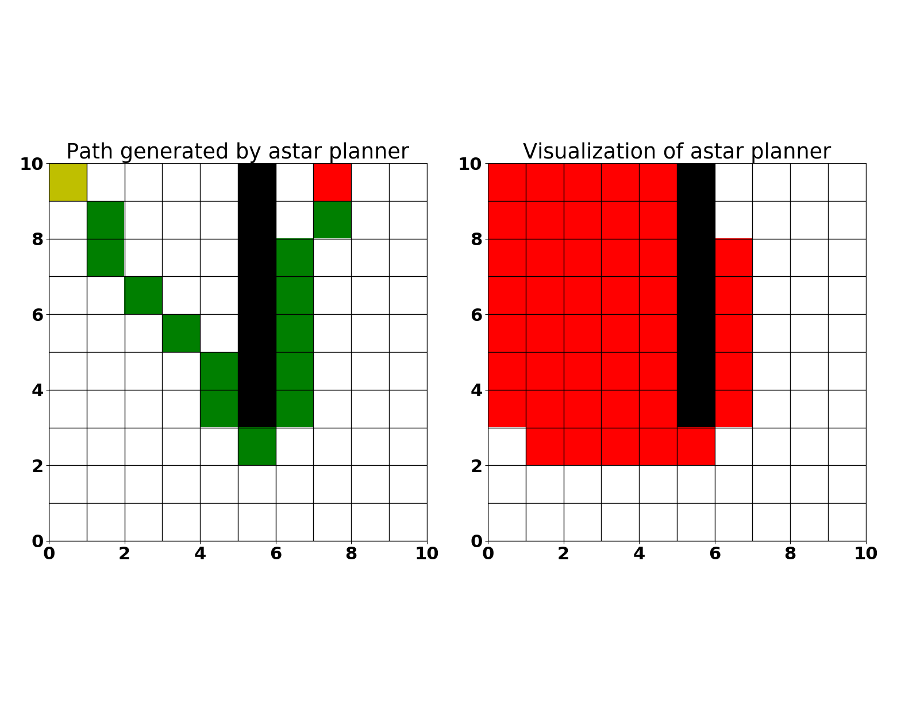
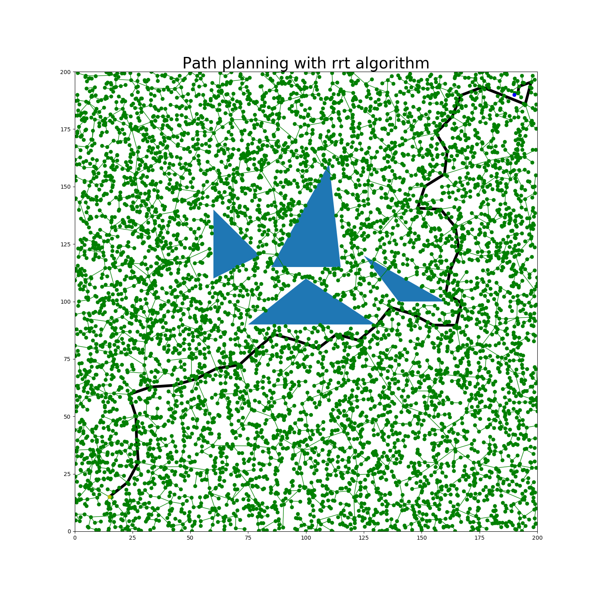

# Motion Planning
Implementations of path planning algorithms

## Grid based planners
Here we compare the performance of Dijkstras and AStar algorithms in finding a path from a start (yellow tile) to the goal (red tile). By default, the planner aims to find a path from the top-left corner tile to the top-right corner tile of the grid. It is assumed that the edges of the grid have equal weights.


usage:
```
python3 grid_planners/main.py -h
```


<div align=right>
<table>
  <tr>
    <td></a></td>
    <td></a></td>
  </tr>
</table>
<table>
  <tr>
    <td>
        ```
        python3 grid_planners/main -n 10 -a dijsktras
        ```
    </td>
    <td>
        ```
        python3 grid_planners/main -n 10 -a astar
        ```
    </td>
  </tr>
</table>
</div>

#### Path planning with Dijkstras algorithm on a 2D grid
```
python3 grid_planners/main -n 10 -a dijsktras
```


Terminal output:
```
Solving using Dijkstras...
    Found goal (0, 9) with distance 19
Path found from (0, 0) to (0, 9) after expanding 93 nodes!
Path: [(0, 0), (1, 0), (2, 0), (3, 0), (4, 0), (5, 0), (5, 1), (5, 2), (5, 3), (5, 4), (5, 5), (5, 6), (4, 6), (3, 6), (2, 6), (1, 6), (0, 6), (0, 7), (0, 8), (0, 9)]
```

#### Path planning with Astar algorithm on a 2D grid

```
python3 grid_planners/main -n 10 -a astar
```



Terminal output:
```
Solving using A*...
    Found goal (0, 9) with distance 19 and f 0.0
Path found from (0, 0) to (0, 9) after expanding 57 nodes!
Path: [(0, 0), (0, 1), (0, 2), (0, 3), (0, 4), (1, 4), (2, 4), (3, 4), (4, 4), (5, 4), (5, 5), (5, 6), (4, 6), (3, 6), (3, 7), (2, 7), (2, 8), (1, 8), (1, 9), (0, 9)]


```

## Free space planners

usage:
```
python3 free_space_planners/main.py -h
```

### Path planning with RRT in free space with obstacles

```
python3 free_space_planners/main.py -a rrt
```
```
Path from [15, 15] to [190, 190] found with distance 388.033102354826 after expanding 7000 nodes
 rrt ran for 0.3900134563446045s
```




### Path planning with RRT* in free space with obstacles

```
python3 free_space_planners/main.py -a rrtstar
```

```
Path from [15, 15] to [190, 190] found with distance 271.3592691760186 after expanding 7000 nodes
 rrtstar ran for 1.7262961864471436s
```


### Path planning with Informed-RRT* in free space with obstacles

```
python3 free_space_planners/main.py -a irrtstar
```

```
Path from [15, 15] to [190, 190] found with distance 256.3809869882846 after expanding 7000 nodes
 irrtstar ran for 4.364379405975342s

```


